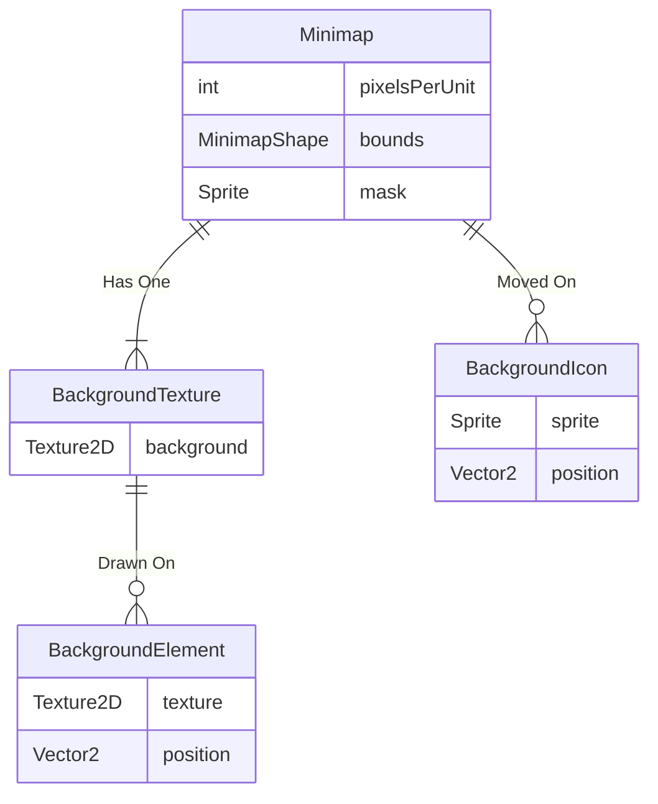

# Code Design

Minimap is composed of a few components.

1. UI element to represent map on screen.
1. Bounds (world space of the minimap).
1. Scale (number of pixels per world unit).
1. Background texture.
1. Moving Icons.

## Minimap Implementations

The interface @nickmaltbie.MinimapTools.Minimap.IMinimap
represents the main responsibilities of a minimap. An important member of the IMinimap is the
@nickmaltbie.MinimapTools.Minimap.IMinimap.GetWorldBounds function
which returns a @nickmaltbie.MinimapTools.Minimap.Shape.IMinimapShape.
The minimap shape determines the space that the minimap
takes up in real world space and is used in the minimap's
function @nickmaltbie.MinimapTools.Minimap.IMinimap.GetMinimapPosition(Vector3)
 which converts from world space to minimap space.
World space is a @UnityEngine.Vector3 while minimap space is a
@UnityEngine.Vector2 relative to the bottom right corner of
the map.

### Minimap Coordinate Space

Since this is designed with a 3D game in mind, we somehow have to convert the 3D
space of points to the 2D space of the minimap. In order to do this conversion
we need to have a way to represent objects in the minimap space.

To get around this problem, I created the @nickmaltbie.MinimapTools.Minimap.Shape.IMinimapShape
interface to handle this behavior. This is useful for both the minimap itself
as well as objects or icons that may be added to the minimap.
The @nickmaltbie.MinimapTools.Minimap.Shape.MinimapSquare is a concrete
implementation of this minimap shape as a simple square and has the code
to be able to get the shape of an object from 3D space to a 3D plane
as a configurable square.

### Implementations

There are two implementations of the @nickmaltbie.MinimapTools.Minimap.IMinimap :

* @nickmaltbie.MinimapTools.Minimap.Centered.CenteredMinimap -
    A Centered minimap that will move and or rotate with a selected minimap
    icon from a tag. Also supports scaling the map to be larger or smaller.
* @nickmaltbie.MinimapTools.Minimap.Simple.SimpleStaticMinimap -
    This is a simple minimap that will draw the background and objects
    on the minimap

Both of these implementations are based on the abstract class
@nickmaltbie.MinimapTools.Minimap.AbstractMinimap which has all the base
functions for how the minimap should work including setting up the background
and managing icons.

## Minimap Layers

The @nickmaltbie.MinimapTools.Minimap.AbstractMinimap configures the
minimap to fit within its current RectTransform and will
create a background texture within a supplied mask. The mask contains
the minimap image within that area of the screen and can be any shape.

### Minimap Layout

The minimap is organized into a few different sections.
The minimap itself has a background texture drawn within
the mask. The @nickmaltbie.MinimapTools.Background.BackgroundTexture
has many @nickmaltbie.MinimapTools.Background.IMinimapElement drawn on top of it.
In addition, multiple @nickmaltbie.MinimapTools.Icon.IMinimapIcon are created as @UnityEngine.GameObject on
top of the minimap and moved independently.

The organization is basically

* @nickmaltbie.MinimapTools.Background.IMinimapElement -
    Drawn on the background and never moves
* @nickmaltbie.MinimapTools.Icon.IMinimapIcon - Move on top of the
    minimap along with the game.

## Minimap Components

The following is a description of the code for minimap
components.

### Background Texture

The @nickmaltbie.MinimapTools.Background.BackgroundTexture is a class
which supports creating a large texture and drawing elements on top of
the background texture.

### Minimap Elements

Background elements implement the @nickmaltbie.MinimapTools.Background.IMinimapElement interface.
There are two implementations of the @nickmaltbie.MinimapTools.Background.IMinimapElement

* @nickmaltbie.MinimapTools.Background.BoxMinimapElement -
    Box minimap that will draw a solid box on the background at a given
    position, rotation, and size.
* @nickmaltbie.MinimapTools.Background.SpriteMinimapElement -
    Sprite minimap element that will draw a given texture on the
    background at a given position, rotation, and size.

Both of these are derived from the @nickmaltbie.MinimapTools.Background.AbstractMinimapElement
class which contains useful functions for
drawing the element at the position relative to the world space.

The static class @nickmaltbie.MinimapTools.Utils.TextureUtils has
useful functions for managing sprites and textures in Unity.

### Minimap Icon

Minimap icons implement the @nickmaltbie.MinimapTools.Icon.IMinimapElement interface.
There are two implementation of the @nickmaltbie.MinimapTools.Icon.IMinimapElement

* @nickmaltbie.MinimapTools.Icon.FixedSizeSpriteIcon -
    Icon that will always have the same pixel size on the minimap no matter
    the zoom level.
* @nickmaltbie.MinimapTools.Icon.RelativeSizeIcon -
    Icon that will scale with the map to maintain a consist size
    with its world size with the @nickmaltbie.MinimapTools.Minimap.IMinimap.PixelsPerUnit
    So if an element was 1x1 units and the pixel scale was 30 pixels per unit, it
    would scale the icon to be 30x30 pixels

These are derived from the @nickmaltbie.MinimapTools.Icon.AbstractSizeIcon
class which contains useful functions for managing a sprite
and creating a @UnityEngine.GameObject icon as a child of the minimap.
